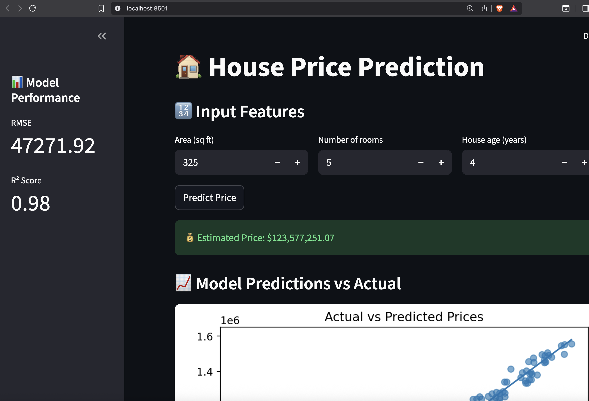

# 📌 House Price Prediction – End-to-End ML Deployment with Streamlit & Docker

An **end-to-end machine learning project** that covers **data preprocessing, model training, evaluation, and deployment** using **Streamlit** inside a **Docker container**. Designed for **intermediate ML engineers and data scientists** to showcase ML workflow and deployment skills.


---
## Application Preview



## 🎯 Problem Statement

Predict **house prices** based on numerical features such as:

- House area (sq ft)  
- Number of rooms  
- House age (years)  

This classic regression task can easily be extended to other applications like:

- Loan approval prediction  
- Customer churn prediction  
- Energy consumption forecasting  

---

## 🧠 Tech Stack

- **Python 3.10**  
- **scikit-learn** (Linear Regression)  
- **pandas / numpy**  
- **joblib** (model serialization)  
- **Streamlit** (interactive UI)  
- **Docker** (containerization)

---

## 📁 Project Structure

```
├── app
│   └── app.py                 # Streamlit application
├── data
│   ├── create_synthetic_data.py
│   └── housing.csv            # Dataset
├── Dockerfile
├── models
│   └── model.pkl              # Trained ML model
├── README.md
├── requirements.txt
└── src
    ├── __init__.py
    ├── predict.py
    ├── preprocess.py
    ├── train.py
    └── utils.py
```

---

## ⚡ Prerequisites

- **Docker** installed on your machine  
- **Python 3.10+** (for local testing if needed)  
- Optional: create a virtual environment  

```bash
python -m venv env
source env/bin/activate
pip install -r requirements.txt
```

---

## 🚀 Step 1: Generate or Use Existing Dataset

You can either generate a synthetic dataset:

```bash
python src/create_synthetic_data.py
```

or use your own `housing.csv` placed inside the `/data` folder.

---

## 🚀 Step 2: Train the Model

Train the ML model locally or during Docker build:

```bash
python src/train.py
```

This will:

- Preprocess the data  
- Train a Linear Regression model  
- Save the model (`models/model.pkl`) and evaluation metrics (`models/metrics.json`)  

---

## 🚀 Step 3: Build and Run Docker Container

1. Build the Docker image:

```bash
docker build -t ml-houseprice-app .
```

2. Run the Docker container:

```bash
docker run -p 8501:8501 ml-houseprice-app
```

3. Streamlit will start, and the logs will show:

```
* Running on http://0.0.0.0:8501
```

---

## 🔍 Step 4: Access the App

Open your browser and navigate to:

```
http://127.0.0.1:8501
```

- Enter **house features** in the interface  
- Click **Predict** to see the **estimated house price**  
- Sidebar displays **RMSE and R² metrics**  
- Bottom panel shows **Actual vs Predicted prices scatter plot**

---

## 💻 App Features

- Simple, interactive **Streamlit UI**  
- **Real-time predictions** from trained model  
- **Model performance metrics** (RMSE, R²) in sidebar  
- **Visualization**: Predicted vs Actual house prices  

---

## ⚙️ Notes

- The project uses **Streamlit’s development server** for simplicity  
- Docker ensures **consistent environment** across machines  
- You can replace `housing.csv` with your own dataset  

---

## 📄 License

**MIT License** – free to use, modify, and distribute.

---

## 📚 References

- Michel M. Nzikou, Jan 2026 @ DMN SOLUTIONS, Perth, WA, Australia

