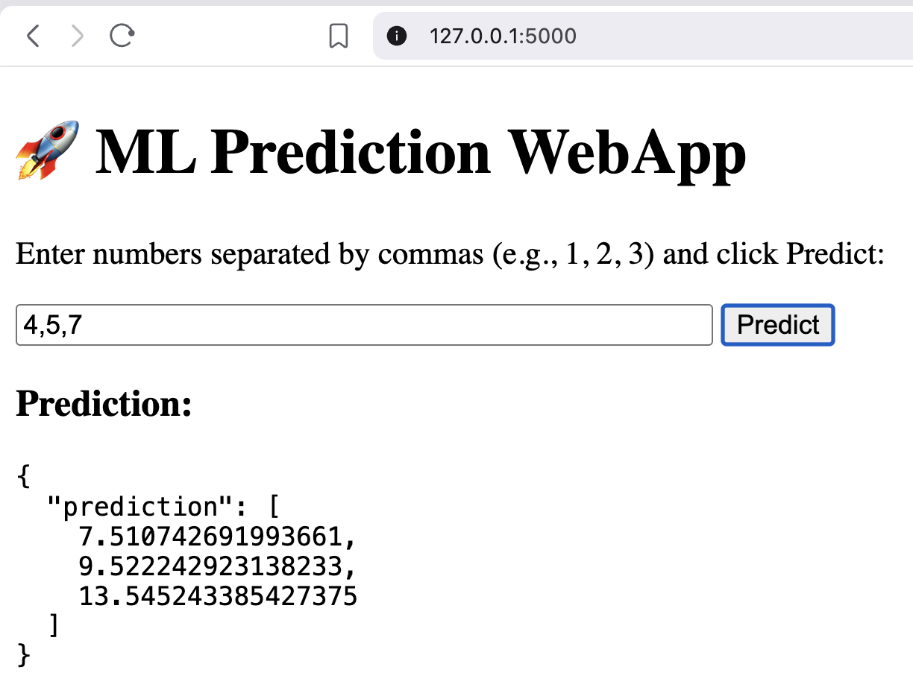

# ML App with Synthetic Data and Linear Regression


This project demonstrates a simple machine learning workflow: generating synthetic data, training a linear regression model, and deploying a web app using Flask inside a Docker container.

---
## Application Preview



## Project Structure

- **train.py** – Generates synthetic data and trains a linear regression model. After training, it saves the model to `model.pkl`.
- **app.py** – Main Flask application that loads the trained model and provides a web interface for testing predictions. This app is designed to run inside a Docker container.
- **Dockerfile** – Defines the Docker image used to containerize the application.

---

## Prerequisites

- Docker installed on your machine  
- Python 3.x (for local testing if needed)  
- `joblib`, `numpy`, `flask` (if running without Docker)

---

## Step 1: Train the Model

Train the model using synthetic data:

```bash
python train.py
```

This will generate a `model.pkl` file in the project directory, which will be loaded by the Flask app.

---

## Step 2: Run the Flask App in Docker

1. Build the Docker image:

```bash
docker build -t ml-app .
```

2. Run the Docker container:

```bash
docker run -p 5000:5000 ml-app
```

3. Successful startup output will look like:

```
* Running on http://127.0.0.1:5000
* Running on http://172.17.0.2:5000
✅ Model loaded successfully from model.pkl
```

---

## Step 3: Test the App

Open your browser and navigate to:

http://127.0.0.1:5000

You can now enter numeric values into the web interface and see predictions from the trained linear regression model instantly.

---

## HTML Interface

The application includes a simple HTML front-end that allows users to:
- Enter numeric input values
- Submit inputs via the browser
- View model predictions immediately

No manual POST requests or API tools are required.

---

## Notes

- This project uses Flask’s development server. Do **not** use it directly in production.
- For production deployment, consider using **Gunicorn** or another WSGI server.
- Ensure `model.pkl` exists before starting the Docker container.

---

## License

MIT License – free to use, modify, and distribute.
