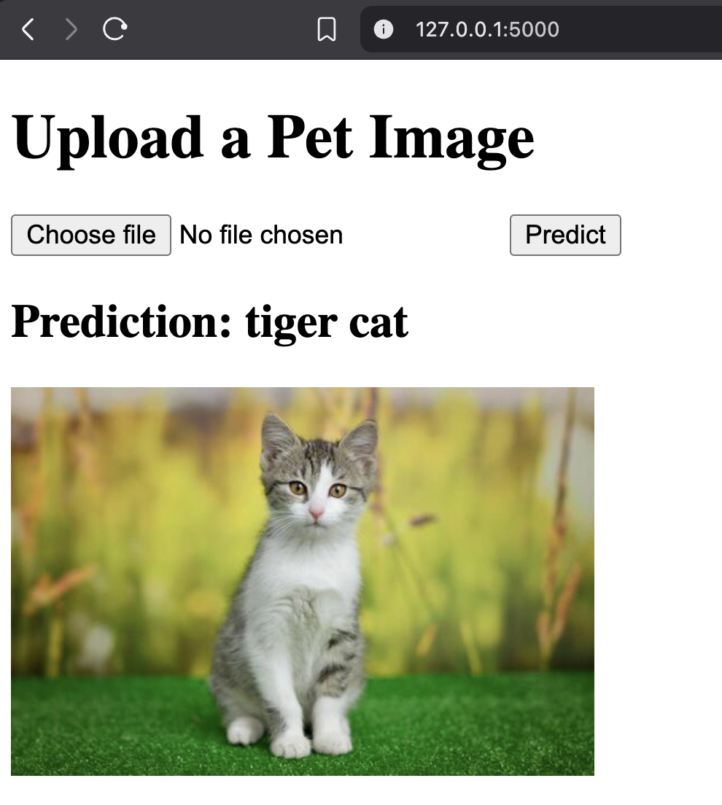

# ML App with Synthetic Data and Linear Regression


This project showcases a complete image classification workflow using a pretrained ImageNet model. Users can upload any image, and the system predicts its class. The solution is deployed as a web application using Flask, all packaged within a Docker container for easy setup and portability.

---
## Application Preview



## Project Structure

pet-classifier/
├─ Dockerfile
├─ requirements.txt
├─ app/
│  ├─ app.py
│  ├─ model.py
│  ├─ templates/
│  └─ static/
└─ assets/   # your images


<!-- - **app.py** – Main Flask application that loads the trained model and provides a web interface for testing predictions. This app is designed to run inside a Docker container.
- **Dockerfile** – Defines the Docker image used to containerize the application.
 -->
---

## Prerequisites

- Docker installed on your machine  
- Python 3.11 (for local testing if needed)  
- Create a new environment name:petenv

---

## Step 1: Use Preexisting Model

We leverage the pretrained ImageNet classes to enable predictions on any uploaded image. The class labels are fetched directly from the PyTorch GitHub repository:

```bash
url = "https://raw.githubusercontent.com/pytorch/hub/master/imagenet_classes.txt"
```
A simple API request is used to load the class names, which are then used to interpret the model’s predictions.

---

## Step 2: Run the Flask App in Docker

1. Build the Docker image:

```bash
docker build -t pet-classifier .
```

2. Run the Docker container:

```bash
docker run -p 5000:5000 pet-classifier
```

3. Successful startup output will look like:

```
* Running on http://127.0.0.1:5000
* Running on http://172.17.0.2:5000
✅ Model loaded successfully from model.pkl
```

---

## Step 3: Test the App

Open your browser and navigate to:

http://127.0.0.1:5000

You can now enter numeric values into the web interface and see predictions from the trained linear regression model instantly.

---

## HTML Interface

The application features a simple HTML front-end that lets users:

Upload an image from their device

Click “Predict” to generate the predicted class, which is displayed above the uploaded image

---

## Notes

- This project uses Flask’s development server. Do **not** use it directly in production.
- For production deployment, consider using **Gunicorn** or another WSGI server.

---

## License

MIT License – free to use, modify, and distribute.

## References:
  - Sole work of Michel M. Nzikou 
